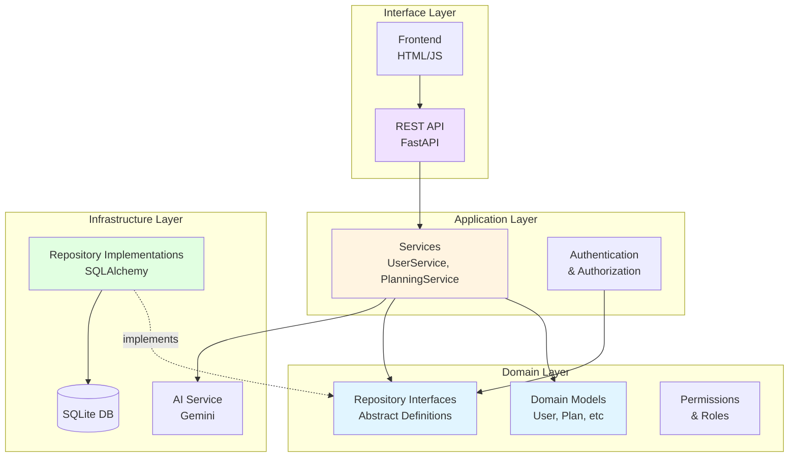
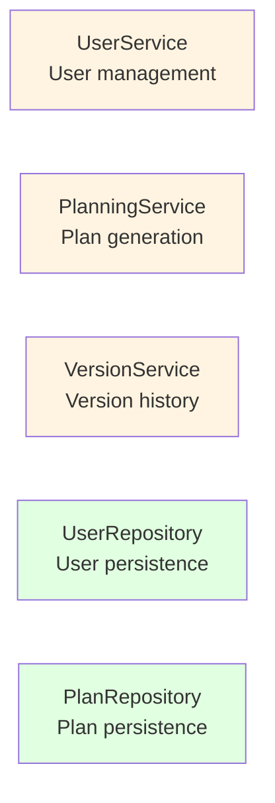
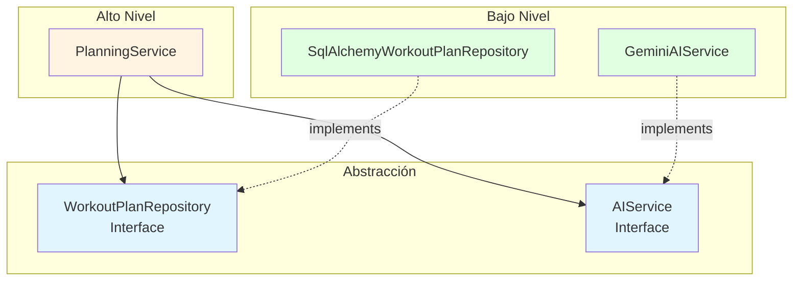
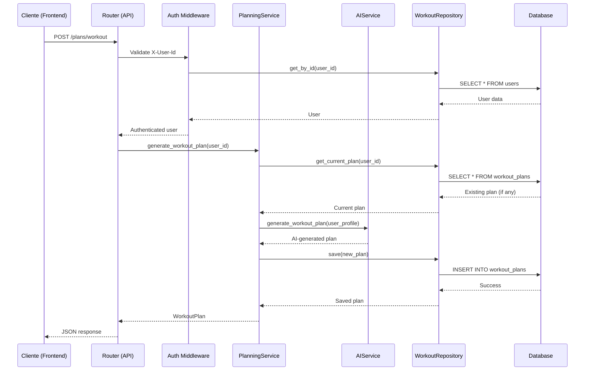
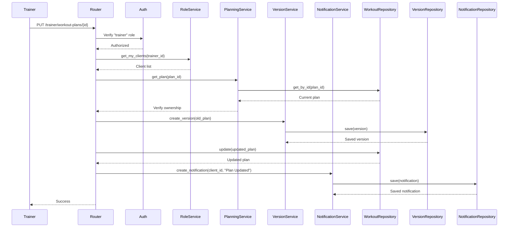

# AI Fitness Agent Architecture

## Overview

The project follows a **layered architecture** inspired by Clean Architecture and Domain-Driven Design, with strict application of SOLID principles.



---

## Layer Structure

### 1. **Domain Layer** (`src/domain/`)
**Responsibility**: Contains pure business logic, with no external dependencies.

**Components**:
- **Models** ([models.py](file:///Users/felipe/Documents/software_propio/agent_fitness/src/domain/models.py)): Domain entities (User, WorkoutPlan, NutritionPlan, etc.)
- **Repository Interfaces** ([repositories.py](file:///Users/felipe/Documents/software_propio/agent_fitness/src/domain/repositories.py)): Abstract persistence contracts
- **Permissions** ([permissions.py](file:///Users/felipe/Documents/software_propio/agent_fitness/src/domain/permissions.py)): Role and permission definitions

### 2. **Application Layer** (`src/application/`)
**Responsibility**: Orchestrates business logic and coordinates between domain and infrastructure.

**Components**:
- [user_service.py](file:///Users/felipe/Documents/software_propio/agent_fitness/src/application/user_service.py): `UserService` - User management
- [planning_service.py](file:///Users/felipe/Documents/software_propio/agent_fitness/src/application/planning_service.py): `PlanningService` - Plan generation and management
- [role_service.py](file:///Users/felipe/Documents/software_propio/agent_fitness/src/application/role_service.py): Role management and assignments
- [version_service.py](file:///Users/felipe/Documents/software_propio/agent_fitness/src/application/version_service.py): Plan version control
- [comment_service.py](file:///Users/felipe/Documents/software_propio/agent_fitness/src/application/comment_service.py): Plan comments
- [notification_service.py](file:///Users/felipe/Documents/software_propio/agent_fitness/src/application/notification_service.py): Notification system
- [interfaces.py](file:///Users/felipe/Documents/software_propio/agent_fitness/src/application/interfaces.py): External service interfaces (AIService)

### 3. **Infrastructure Layer** (`src/infrastructure/`)
**Responsibility**: Concrete implementations of technologies and frameworks.

**Components**:
- **Repositories** (`repositories/`): SQLAlchemy implementations segregated by domain
  - [user_repository.py](file:///Users/felipe/Documents/software_propio/agent_fitness/src/infrastructure/repositories/user_repository.py)
  - [workout_repository.py](file:///Users/felipe/Documents/software_propio/agent_fitness/src/infrastructure/repositories/workout_repository.py)
  - [nutrition_repository.py](file:///Users/felipe/Documents/software_propio/agent_fitness/src/infrastructure/repositories/nutrition_repository.py)
  - [version_repository.py](file:///Users/felipe/Documents/software_propio/agent_fitness/src/infrastructure/repositories/version_repository.py)
  - [comment_repository.py](file:///Users/felipe/Documents/software_propio/agent_fitness/src/infrastructure/repositories/comment_repository.py)
  - [notification_repository.py](file:///Users/felipe/Documents/software_propio/agent_fitness/src/infrastructure/repositories/notification_repository.py)
- **AI Services** (`ai/`): AI providers using Template Method Pattern
  - [base.py](file:///Users/felipe/Documents/software_propio/agent_fitness/src/infrastructure/ai/base.py): `BaseAIService` with shared logic
  - [gemini.py](file:///Users/felipe/Documents/software_propio/agent_fitness/src/infrastructure/ai/gemini.py): Google Gemini integration
  - [openai.py](file:///Users/felipe/Documents/software_propio/agent_fitness/src/infrastructure/ai/openai.py): OpenAI integration
- [database.py](file:///Users/felipe/Documents/software_propio/agent_fitness/src/infrastructure/database.py): Database configuration
- [orm_models.py](file:///Users/felipe/Documents/software_propio/agent_fitness/src/infrastructure/orm_models.py): SQLAlchemy ORM models

### 4. **Interface Layer** (`src/interfaces/`)
**Responsibility**: Entry points to the system (API, CLI, etc.).

**Components**:
- **API** (`api/`):
  - [routers.py](file:///Users/felipe/Documents/software_propio/agent_fitness/src/interfaces/api/routers.py): Main endpoints
  - [advanced_routers.py](file:///Users/felipe/Documents/software_propio/agent_fitness/src/interfaces/api/advanced_routers.py): Advanced endpoints (versions, comments)
  - [auth.py](file:///Users/felipe/Documents/software_propio/agent_fitness/src/interfaces/api/auth.py): Authentication and authorization
  - **DTOs** (`dto/`): Data Transfer Objects for request/response
    - [user_dto.py](file:///Users/felipe/Documents/software_propio/agent_fitness/src/interfaces/api/dto/user_dto.py): User DTOs
    - [plan_dto.py](file:///Users/felipe/Documents/software_propio/agent_fitness/src/interfaces/api/dto/plan_dto.py): Plan DTOs
    - [auth_dto.py](file:///Users/felipe/Documents/software_propio/agent_fitness/src/interfaces/api/dto/auth_dto.py): Auth DTOs
- **Frontend** (`frontend/`): Web user interface

### 5. **Configuration** ([config.py](file:///Users/felipe/Documents/software_propio/agent_fitness/src/config.py))
**Responsibility**: Centralized application configuration (environment variables, AI providers, database).

### 6. **Dependency Injection** ([dependencies.py](file:///Users/felipe/Documents/software_propio/agent_fitness/src/dependencies.py))
**Responsibility**: Composition Root - assembles all application dependencies.

---

## SOLID Principles Application

### **S - Single Responsibility Principle**

Each class has a single, well-defined responsibility:



**Examples**:
- `UserService`: Only manages user operations (registration, profile updates)
- `PlanningService`: Only manages plan generation and activation
- `SqlAlchemyUserRepository`: Only handles user persistence in DB

### **O - Open/Closed Principle**

The system is open for extension but closed for modification:

**Example**: Switching from SQLite to PostgreSQL

```python
# NO existing code is modified
# ONLY create new implementation

class PostgresUserRepository(UserRepository):
    def __init__(self, db: Session):
        self.db = db
    
    def get_by_id(self, user_id: str) -> Optional[User]:
        # PostgreSQL implementation
        ...

# In dependencies.py
def get_user_repository() -> UserRepository:
    return PostgresUserRepository(db)  # ← Change here
```

### **L - Liskov Substitution Principle**

Any implementation of an interface can substitute another without breaking the system:

```python
# Both implementations respect the contract
class SqlAlchemyUserRepository(UserRepository):
    def get_by_id(self, user_id: str) -> Optional[User]:
        # SQLAlchemy implementation
        ...

class MockUserRepository(UserRepository):
    def get_by_id(self, user_id: str) -> Optional[User]:
        # Mock implementation for tests
        ...

# The service works with any implementation
service = UserService(user_repo)  # user_repo can be any implementation
```

### **I - Interface Segregation Principle**

Interfaces are designed to be specific and not force clients to depend on methods they don't use.

#### Segregated User Repository

```python
class UserRepository(ABC):
    """CRUD básico"""
    @abstractmethod
    def get_by_id(self, user_id: str) -> Optional[User]: pass
    
class UserQueryRepository(ABC):
    """Consultas complejas"""
    @abstractmethod
    def get_by_role(self, role: str) -> List[User]: pass
    
class UserRelationshipRepository(ABC):
    """Relaciones trainer/nutritionist"""
    @abstractmethod
    def get_clients_by_trainer(self, trainer_id: str) -> List[User]: pass

class CompleteUserRepository(UserRepository, UserQueryRepository, UserRelationshipRepository, ABC):
    """Para servicios que requieren funcionalidad completa"""
    pass
```

**Benefit**: `UserService` only depends on `UserRepository` (CRUD), while `RoleService` uses `CompleteUserRepository`.

#### Generic Plan Repository

```python
class PlanRepository(ABC, Generic[T]):
    """Generic base for plans"""
    @abstractmethod
    def get_by_id(self, plan_id: str) -> Optional[T]: pass
    @abstractmethod
    def update(self, plan: T) -> None: pass

class WorkoutPlanRepository(PlanRepository[WorkoutPlan]): pass
class NutritionPlanRepository(PlanRepository[NutritionPlan]): pass
```

**Benefit**: Eliminates duplication and ensures type safety with Generics.


### **D - Dependency Inversion Principle**

High-level layers DO NOT depend on low-level layers. Both depend on abstractions:



**Implementation**: Using FastAPI Dependency Injection

```python
# dependencies.py coordinates everything
def get_planning_service(
    ai_service: AIService = Depends(get_ai_service),
    workout_repo: WorkoutPlanRepository = Depends(get_workout_repository),
    nutrition_repo: NutritionPlanRepository = Depends(get_nutrition_repository),
    user_repo: UserRepository = Depends(get_user_repository)
) -> PlanningService:
    return PlanningService(ai_service, workout_repo, nutrition_repo, user_repo)

# routers.py uses the abstraction
@router.post("/plans/workout")
def generate_workout(
    current_user: User = Depends(get_current_user),
    service: PlanningService = Depends(get_planning_service)  # ← Injection
):
    return service.generate_workout_plan(current_user.id)
```

---

## Component Interaction Flow

### Example: Workout Plan Creation



### Example: Plan Update by Trainer



---

## Applied Design Patterns

### 1. **Repository Pattern**
Abstracts data persistence from the domain.

### 2. **Dependency Injection**
Centralized in [dependencies.py](file:///Users/felipe/Documents/software_propio/agent_fitness/src/dependencies.py), enables:
- Easy testing with mocks
- Changing implementations without modifying code
- Complete decoupling between layers

### 3. **Service Layer Pattern**
Services in `src/application/` orchestrate complex operations.

### 4. **Strategy Pattern**
Implemented through interfaces:
- `AIService` has multiple implementations: `GeminiAIService`, `OpenAIService`
- Provider is selected in `dependencies.py` based on `config.DEFAULT_AI_PROVIDER`

###5. **Template Method Pattern**
Applied to AI services to eliminate code duplication:

```python
class BaseAIService(AIService, ABC):
    """Base class with shared logic"""
    
    def generate_workout_plan(self, profile: UserProfile) -> Dict[str, Any]:
        prompt = self._build_workout_prompt(profile)  # Método compartido
        response = self._call_ai_api(prompt)          # Método abstracto (hook)
        return self._parse_json_response(response)     # Método compartido
    
    @abstractmethod
    def _call_ai_api(self, prompt: str) -> str:
        """Cada proveedor implementa su llamada API específica"""
        pass

class GeminiAIService(BaseAIService):
    def _call_ai_api(self, prompt: str) -> str:
        response = self.model.generate_content(prompt)
        return response.text

class OpenAIService(BaseAIService):
    def _call_ai_api(self, prompt: str) -> str:
        response = self.client.chat.completions.create(...)
        return response.choices[0].message.content
```

**Benefit**: Prompts and JSON parsing are centralized in `BaseAIService`. Each provider only implements the specific API call.

### 6. **Factory Pattern**
`get_*_service()` functions in `dependencies.py` act as factories that build objects with their dependencies.

### 7. **DTO Pattern**
Data Transfer Objects in `src/interfaces/api/dto/` for request/response, separated from domain models.

---

## Architecture Advantages

1. **Testability**: Each layer can be tested independently
2. **Maintainability**: Organized code with clear responsibilities
3. **Flexibility**: Easy to change technologies (DB, AI provider, etc.)
4. **Scalability**: Layers can be split into microservices if needed
5. **Reusability**: Services and repositories are reusable

---

## Next Architectural Steps

- [ ] Implement caching with Redis
- [ ] Add event bus for real-time notifications
- [ ] Migrate to PostgreSQL in production
- [ ] Dockerize the application
- [ ] Implement API Gateway if scaling to microservices
