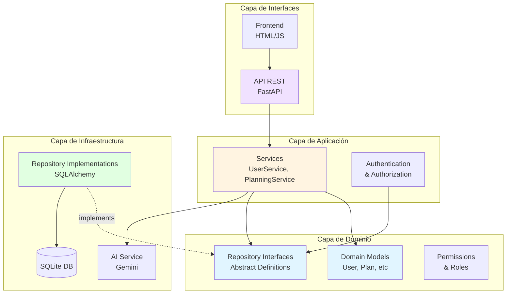
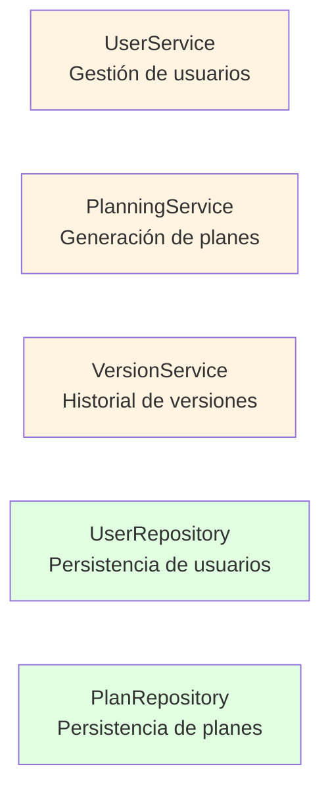
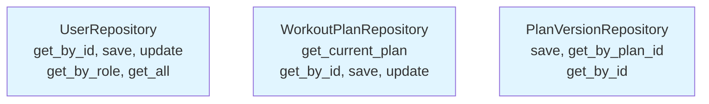
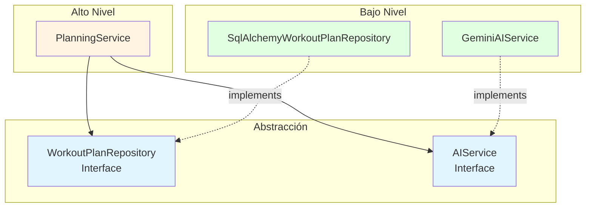
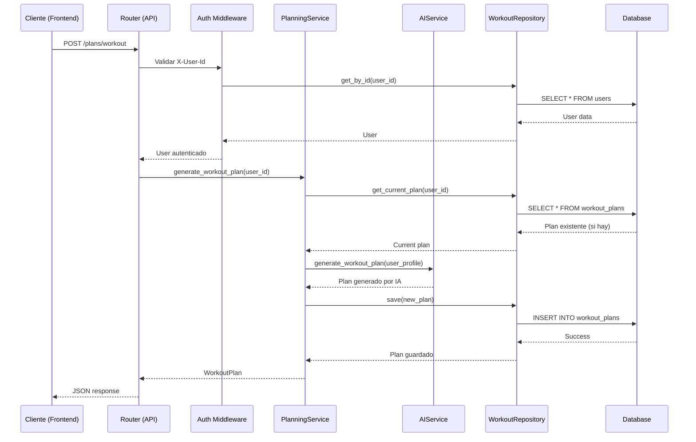
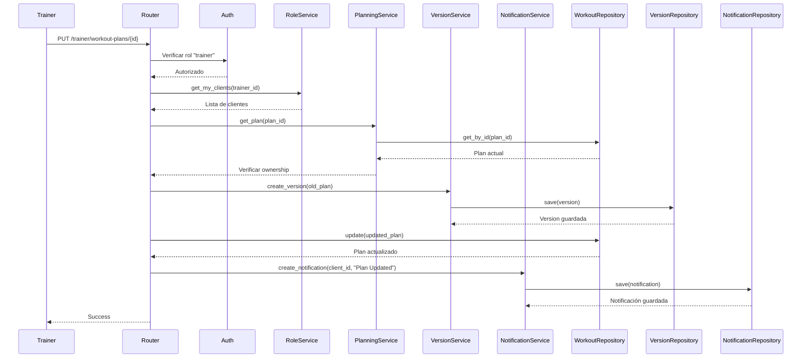

# Arquitectura del AI Fitness Agent

## Visión General

El proyecto sigue una **arquitectura en capas** inspirada en Clean Architecture y Domain-Driven Design, con estricta aplicación de los principios SOLID.



---

## Estructura de Capas

### 1. **Domain Layer** (`src/domain/`)
**Responsabilidad**: Contiene la lógica de negocio pura, sin dependencias externas.

**Componentes**:
- **Models** ([models.py](file:///Users/felipe/Documents/software_propio/agent_fitness/src/domain/models.py)): Entidades del dominio (User, WorkoutPlan, NutritionPlan, etc.)
- **Repository Interfaces** ([repositories.py](file:///Users/felipe/Documents/software_propio/agent_fitness/src/domain/repositories.py)): Contratos abstractos para persistencia
- **Permissions** ([permissions.py](file:///Users/felipe/Documents/software_propio/agent_fitness/src/domain/permissions.py)): Definición de roles y permisos

### 2. **Application Layer** (`src/application/`)
**Responsabilidad**: Orquesta la lógica de negocio y coordina entre dominio e infraestructura.

**Componentes**:
- [services.py](file:///Users/felipe/Documents/software_propio/agent_fitness/src/application/services.py): `UserService`, `PlanningService`
- [role_service.py](file:///Users/felipe/Documents/software_propio/agent_fitness/src/application/role_service.py): Gestión de roles
- [version_service.py](file:///Users/felipe/Documents/software_propio/agent_fitness/src/application/version_service.py): Control de versiones
- [comment_service.py](file:///Users/felipe/Documents/software_propio/agent_fitness/src/application/comment_service.py): Comentarios en planes
- [notification_service.py](file:///Users/felipe/Documents/software_propio/agent_fitness/src/application/notification_service.py): Notificaciones

### 3. **Infrastructure Layer** (`src/infrastructure/`)
**Responsabilidad**: Implementaciones concretas de tecnologías y frameworks.

**Componentes**:
- **Repositories** (`repositories/`): Implementaciones SQLAlchemy de las interfaces del dominio
- [database.py](file:///Users/felipe/Documents/software_propio/agent_fitness/src/infrastructure/database.py): Configuración de base de datos
- [ai_service.py](file:///Users/felipe/Documents/software_propio/agent_fitness/src/infrastructure/ai_service.py): Integración con Gemini AI
- [orm_models.py](file:///Users/felipe/Documents/software_propio/agent_fitness/src/infrastructure/orm_models.py): Modelos ORM de SQLAlchemy

### 4. **Interface Layer** (`src/interfaces/`)
**Responsabilidad**: Puntos de entrada al sistema (API, CLI, etc.).

**Componentes**:
- **API** (`api/`):
  - [routers.py](file:///Users/felipe/Documents/software_propio/agent_fitness/src/interfaces/api/routers.py): Endpoints principales
  - [advanced_routers.py](file:///Users/felipe/Documents/software_propio/agent_fitness/src/interfaces/api/advanced_routers.py): Endpoints avanzados
  - [auth.py](file:///Users/felipe/Documents/software_propio/agent_fitness/src/interfaces/api/auth.py): Autenticación y autorización
- **Frontend** (`frontend/`): Interfaz web del cliente

### 5. **Dependency Injection** ([dependencies.py](file:///Users/felipe/Documents/software_propio/agent_fitness/src/dependencies.py))
**Responsabilidad**: Configuración centralizada de inyección de dependencias.

---

## Aplicación de Principios SOLID

### **S - Single Responsibility Principle**

Cada clase tiene una única responsabilidad bien definida:



**Ejemplos**:
- `UserService`: Solo gestiona operaciones de usuario (registro, actualización de perfil)
- `PlanningService`: Solo gestiona generación y activación de planes
- `SqlAlchemyUserRepository`: Solo maneja persistencia de usuarios en BD

### **O - Open/Closed Principle**

El sistema está abierto a extensión pero cerrado a modificación:

**Ejemplo**: Cambiar de SQLite a PostgreSQL

```python
# NO se modifica código existente
# SOLO se crea nueva implementación

class PostgresUserRepository(UserRepository):
    def __init__(self, db: Session):
        self.db = db
    
    def get_by_id(self, user_id: str) -> Optional[User]:
        # Implementación PostgreSQL
        ...

# En dependencies.py
def get_user_repository() -> UserRepository:
    return PostgresUserRepository(db)  # ← Cambio aquí
```

### **L - Liskov Substitution Principle**

Cualquier implementación de una interfaz puede sustituir a otra sin romper el sistema:

```python
# Ambas implementaciones respetan el contrato
class SqlAlchemyUserRepository(UserRepository):
    def get_by_id(self, user_id: str) -> Optional[User]:
        # Implementación SQLAlchemy
        ...

class MockUserRepository(UserRepository):
    def get_by_id(self, user_id: str) -> Optional[User]:
        # Implementación mock para tests
        ...

# El servicio funciona con cualquiera
service = UserService(user_repo)  # user_repo puede ser cualquier implementación
```

### **I - Interface Segregation Principle**

Las interfaces están segregadas por dominio específico:



**Beneficio**: Cada repositorio solo expone los métodos que necesita su dominio.

### **D - Dependency Inversion Principle**

Las capas de alto nivel NO dependen de capas de bajo nivel. Ambas dependen de abstracciones:



**Implementación**: Usando FastAPI Dependency Injection

```python
# dependencies.py coordina todo
def get_planning_service(
    ai_service: AIService = Depends(get_ai_service),
    workout_repo: WorkoutPlanRepository = Depends(get_workout_repository),
    nutrition_repo: NutritionPlanRepository = Depends(get_nutrition_repository),
    user_repo: UserRepository = Depends(get_user_repository)
) -> PlanningService:
    return PlanningService(ai_service, workout_repo, nutrition_repo, user_repo)

# routers.py usa la abstracción
@router.post("/plans/workout")
def generate_workout(
    current_user: User = Depends(get_current_user),
    service: PlanningService = Depends(get_planning_service)  # ← Inyección
):
    return service.generate_workout_plan(current_user.id)
```

---

## Flujo de Interacción de Componentes

### Ejemplo: Creación de Plan de Entrenamiento



### Ejemplo: Actualización de Plan por Trainer



---

## Patrones de Diseño Aplicados

### 1. **Repository Pattern**
Abstrae la persistencia de datos del dominio.

### 2. **Dependency Injection**
Centralizado en [dependencies.py](file:///Users/felipe/Documents/software_propio/agent_fitness/src/dependencies.py), permite:
- Fácil testing con mocks
- Cambio de implementaciones sin modificar código
- Desacoplamiento total entre capas

### 3. **Service Layer Pattern**
Los servicios en `src/application/` orquestan operaciones complejas.

### 4. **Strategy Pattern**
Implementado implícitamente a través de interfaces (e.g., `AIService` puede tener múltiples implementaciones: Gemini, OpenAI, etc.)

---

## Ventajas de esta Arquitectura

1. **Testabilidad**: Cada capa puede probarse independientemente
2. **Mantenibilidad**: Código organizado y con responsabilidades claras
3. **Flexibilidad**: Fácil cambiar tecnologías (BD, AI provider, etc.)
4. **Escalabilidad**: Capas pueden dividirse en microservicios si es necesario
5. **Reusabilidad**: Servicios y repositorios son reutilizables

---

## Próximos Pasos Arquitectónicos

- [ ] Implementar caching con Redis
- [ ] Agregar event bus para notificaciones en tiempo real
- [ ] Migrar a PostgreSQL en producción
- [ ] Dockerizar la aplicación
- [ ] Implementar API Gateway si se escala a microservicios
