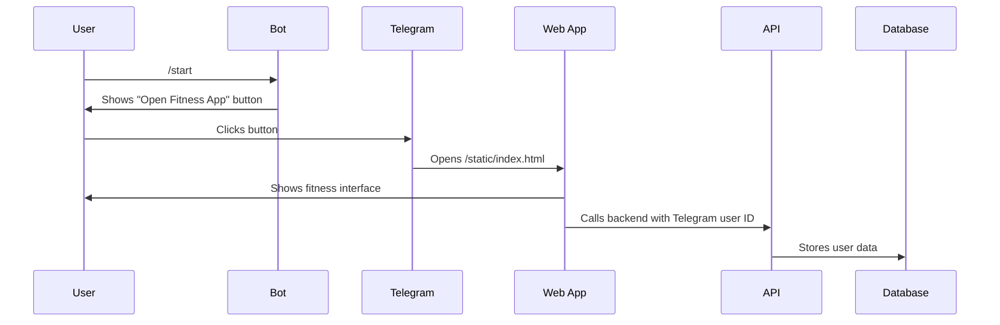

# Telegram Mini App Setup Guide

## Overview
Your AI Fitness Agent has a complete Telegram Mini App integration. Follow these steps to set it up.

## Prerequisites
✅ API deployed on Render (from `DEPLOYMENT.md`)
✅ Supabase database configured (from `SUPABASE_SETUP.md`)

## Step 1: Create Telegram Bot

1. Open Telegram and search for `@BotFather`
2. Send `/newbot`
3. Choose a name: `AI Fitness Coach` (can have spaces)
4. Choose a username: `@AIFitnessCoachBot` (must end in `Bot`, no spaces)
5. **Save the token** (looks like: `123456789:ABCdefGHIjklMNOpqrsTUVwxyz`)

## Step 2: Configure Environment Variables in Render

Go to your service in Render Dashboard → Environment, and add/update:

```bash
# Add this new variable:
TELEGRAM_BOT_TOKEN=123456789:ABCdefGHIjklMNOpqrsTUVwxyz

# Update this with your actual Render URL:
WEB_APP_URL=https://YOUR-SERVICE-NAME.onrender.com/static/index.html
```

**Important**: Replace `YOUR-SERVICE-NAME` with your actual Render service name.

## Step 3: Configure Bot with BotFather

1. Go back to `@BotFather` in Telegram
2. Send `/mybots`
3. Select your bot
4. Click **"Bot Settings"** → **"Menu Button"**
5. Click **"Configure menu button"**
6. Send the Web App URL:
   ```
   https://YOUR-SERVICE-NAME.onrender.com/static/index.html
   ```
7. Send a name for the button: `Open App`

## Step 4: Set Bot Description (Optional)

Still in BotFather:
1. **"Edit Description"**: 
   ```
   AI-powered fitness and nutrition coach. Get personalized workout and meal plans.
   ```

2. **"Edit About"**:
   ```
   Your personal AI fitness assistant
   ```

## Step 5: Test the Mini App

1. Search for your bot in Telegram (`@AIFitnessCoachBot`)
2. Send `/start`
3. Click **"🏋️ Open Fitness App"** button
4. The Mini App should open inside Telegram!

## How It Works



## Features Available in Mini App

✅ **Auto-login** via Telegram (no passwords needed)
✅ **Profile setup** (age, weight, goals)
✅ **Generate workout plans** with AI
✅ **Generate nutrition plans** with AI
✅ **View plan history & versions**
✅ **Add comments** to plans
✅ **Receive notifications**

## Running Bot Locally (Optional)

If you want to run the bot on your machine:

```bash
# Set environment variables
export TELEGRAM_BOT_TOKEN=your_token
export WEB_APP_URL=https://your-app.onrender.com/static/index.html
export DATABASE_URL=your_supabase_url

# Run bot
python src/interfaces/telegram/bot.py
```

## Troubleshooting

### Mini App doesn't open
- Verify `WEB_APP_URL` is correct in Render Dashboard
- Make sure your Render service is running
- Check that `/static/index.html` is accessible

### "User not found" error
- Bot automatically registers users on first `/start`
- Make sure `DATABASE_URL` is configured
- Check Render logs for errors

### Blank screen in Mini App
- Open browser console (if testing on desktop)
- Check API calls are reaching your backend
- Verify Telegram WebApp SDK loaded (line 8 in `index.html`)

## Admin Users (Optional)

To make certain Telegram users admins:

1. Get your Telegram ID from `@userinfobot`
2. In Render Dashboard, add:
   ```
   ADMIN_TELEGRAM_IDS=123456789,987654321
   ```
3. Send `/start` to the bot again
4. You'll see "Your roles: ADMIN, CLIENT"

## Next Steps

- Customize the Mini App UI in `src/interfaces/frontend/`
- Add more features to the bot
- Set up webhooks for better performance (advanced)
